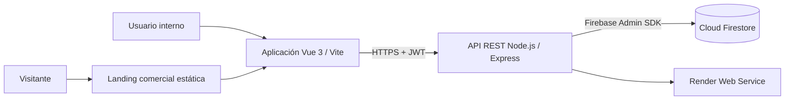

# DVT — Software de Gestión Hotelera

Aplicación web para la gestión operativa de un hotel. Integra un sitio comercial público y una aplicación interna para administrar usuarios, habitaciones, huéspedes, reservas, consumos adicionales y pagos.

## Estado del proyecto

- Aplicación publicada en Render: [https://gestionhotelera-dm5p.onrender.com](https://gestionhotelera-dm5p.onrender.com)
- Sitio comercial: `/`
- Aplicación interna: `/app/login`
- Estado del servicio: `/api/health`

> El plan gratuito de Render puede detener el servicio luego de un período sin tráfico. Al acceder nuevamente a la URL se inicia de forma automática; el primer acceso puede demorar algunos segundos.

## Arquitectura



La landing se entrega desde `public/`. La aplicación Vue compilada se publica bajo `/app/` y consume la API REST. El backend centraliza las reglas de negocio, la autorización y el acceso a Firestore.

## Funcionalidades

- Autenticación mediante JWT y contraseñas almacenadas con hash bcrypt.
- Dos perfiles internos: `ADMIN` y `RECEPCIONISTA`.
- Administración de usuarios y asignación de claves temporales por un administrador.
- Gestión de habitaciones, tipos, capacidad, tarifa, estado y disponibilidad.
- Alta y seguimiento de huéspedes.
- Reservas con validación de fechas y prevención de solapamientos.
- Check-in, check-out, cancelación y consulta de historial operativo.
- Registro de consumos con categorías normalizadas: gastronomía, lavandería, estacionamiento, spa y otros.
- Flujo de cuenta corriente: un consumo pendiente se puede corregir; al agregarlo a cuenta se incorpora al saldo de la reserva; el pago se confirma desde el módulo de pagos.
- Filtros operativos, vistas responsivas y visualización del historial.

## Roles y permisos

| Acción | ADMIN | RECEPCIONISTA |
| --- | :---: | :---: |
| Gestionar usuarios y claves temporales | Sí | No |
| Gestionar habitaciones | Sí | Consulta |
| Gestionar huéspedes | Sí | Sí |
| Crear, editar y operar reservas | Sí | Sí |
| Registrar y corregir consumos pendientes | Sí | Sí |
| Incorporar consumos a la cuenta | Sí | Sí |
| Cerrar o eliminar consumos | Sí | No |
| Registrar y consultar pagos | Sí | Sí |
| Editar o eliminar pagos | Sí | No |

## Tecnologías

| Capa | Tecnologías | Propósito |
| --- | --- | --- |
| Frontend | Vue 3, Vue Router, Vite, CSS | Interfaz interna responsiva y navegación SPA. |
| Landing | HTML, CSS y JavaScript | Presentación comercial pública. |
| Backend | Node.js, Express 5 | API REST, reglas de negocio y middleware. |
| Persistencia | Cloud Firestore, Firebase Admin SDK | Base NoSQL para las entidades operativas. |
| Seguridad | JWT, bcryptjs, CORS, dotenv | Sesión, hash de claves, control de orígenes y secretos. |
| Hosting | Render | Compilación y publicación del servicio web. |

## Estructura principal

```text
GestionHotelera/
├── DVT-SoftwareHotelero/       # Frontend Vue 3/Vite publicado en /app
├── public/                     # Landing comercial estática
├── src/
│   ├── habitaciones/           # Habitaciones y disponibilidad
│   ├── huespedes/              # Huéspedes
│   ├── reservas/               # Reservas y operación de estadía
│   ├── consumos/               # Consumos extras y cuenta corriente
│   ├── pagos/                  # Pagos confirmados
│   ├── password-recovery/      # Solicitudes de clave temporal
│   ├── services/               # Servicios transversales
│   └── middlewares/            # Autenticación, roles y errores
├── database/                   # Datos ficticios y guía de réplica de Firestore
├── scripts/                    # Utilidades seguras de mantenimiento
├── render.yaml                 # Definición del despliegue en Render
└── index.js                    # Punto de entrada de Express
```

## Instalación local

### Requisitos

- Node.js `22.12` o superior.
- Un proyecto de Firebase con Cloud Firestore habilitado.
- Credenciales de una cuenta de servicio de Firebase para el entorno local.

### 1. Instalar dependencias

```powershell
npm ci
Set-Location DVT-SoftwareHotelero
npm ci
Set-Location ..
```

### 2. Configurar variables de entorno

Copiar los ejemplos sin publicar los archivos resultantes:

```powershell
Copy-Item .env.example .env
Copy-Item DVT-SoftwareHotelero\.env.example DVT-SoftwareHotelero\.env
```

En el backend se requiere una de las siguientes opciones para Firebase Admin SDK:

- Archivo local `firebase-credentials.json` en la raíz del proyecto, o
- `FIREBASE_SERVICE_ACCOUNT_BASE64`, o
- `FIREBASE_SERVICE_ACCOUNT_JSON`.

También configurar un `JWT_SECRET` robusto y, si el frontend se ejecuta en otro origen, `CORS_ORIGINS`.

Los archivos `.env` y `firebase-credentials.json` están excluidos de Git. Nunca deben versionarse ni compartirse en capturas, documentación o repositorios.

### 3. Ejecutar en desarrollo

En una terminal, iniciar la API:

```powershell
npm run dev
```

En una segunda terminal, iniciar Vite:

```powershell
Set-Location DVT-SoftwareHotelero
npm run dev
```

La API quedará en `http://localhost:3000` y el frontend en `http://localhost:5173/app/login`.

### 4. Simular producción localmente

```powershell
Set-Location DVT-SoftwareHotelero
npm run build
Set-Location ..
npm start
```

Acceder a `http://localhost:3000/` y a `http://localhost:3000/app/login`.

## Variables de entorno

| Variable | Uso |
| --- | --- |
| `PORT` | Puerto HTTP del backend. Render lo asigna automáticamente. |
| `JWT_SECRET` | Secreto para firmar sesiones JWT. Obligatorio. |
| `CORS_ORIGINS` | Orígenes autorizados, separados por coma. |
| `FIREBASE_SERVICE_ACCOUNT_BASE64` | Cuenta de servicio codificada en Base64, recomendada para Render. |
| `FIREBASE_SERVICE_ACCOUNT_JSON` | Alternativa de JSON de cuenta de servicio. |
| `VITE_API_URL` | URL base de la API durante el desarrollo del frontend. |

## Réplica de Firestore con datos ficticios

El repositorio incluye [database/seed-data.example.json](database/seed-data.example.json) y [scripts/seed-firestore.js](scripts/seed-firestore.js). El script crea una muestra coherente de usuarios, habitaciones, huésped, reserva, disponibilidad, consumos y pago para demostrar la estructura de Firestore.

No exporta una base de producción, no contiene secretos y no elimina ni reemplaza documentos existentes. Se requieren las credenciales locales de Firebase y dos claves de prueba:

```powershell
$env:SEED_ADMIN_PASSWORD='UnaClaveSegura'
$env:SEED_RECEPTIONIST_PASSWORD='OtraClaveSegura'
npm run db:seed -- --apply
```

El argumento `--apply` es obligatorio. Consultar [database/README.md](database/README.md) para el alcance completo.

## Recuperación de acceso

No se envían contraseñas por correo. El usuario interno solicita una clave temporal desde el login. Si el correo corresponde a una cuenta registrada, se genera una solicitud interna; un administrador valida la identidad en el módulo Usuarios, asigna una clave temporal y el usuario queda obligado a cambiarla al iniciar sesión. Las solicitudes se auditan en la colección `SOLICITUDES_RECUPERACION_CLAVE` sin almacenar contraseñas ni tokens.

## API principal

Todos los endpoints, excepto autenticación y salud, requieren un token JWT en el encabezado `Authorization: Bearer <token>`.

| Módulo | Endpoints principales |
| --- | --- |
| Salud | `GET /api/health` |
| Autenticación | `POST /api/auth/login`, `POST /api/auth/forgot-password`, `POST /api/auth/change-password` |
| Usuarios | `GET/POST /api/users`, `PUT/DELETE /api/users/:id`, `PATCH /api/users/:id/temporary-password` |
| Habitaciones | `GET/POST /api/habitaciones`, `GET/PUT/DELETE /api/habitaciones/:id` |
| Huéspedes | `GET/POST /api/huespedes`, `GET/PUT /api/huespedes/:id` |
| Reservas | `GET/POST /api/reservas`, `GET/PUT/DELETE /api/reservas/:id`, `PATCH /api/reservas/:id/check-in`, `PATCH /api/reservas/:id/check-out` |
| Consumos | `GET/POST /api/consumos`, `PUT/DELETE /api/consumos/:id`, `PATCH /api/consumos/:id/incluir-en-cuenta` |
| Pagos | `GET/POST /api/pagos`, `GET/PUT/DELETE /api/pagos/:id` |
| Disponibilidad | `GET /api/disponibilidades/:habitacionId`, `POST /api/disponibilidades` |

Los permisos exactos se aplican en cada ruta mediante los middlewares de autenticación y roles.

## Despliegue en Render

El servicio se define en [render.yaml](render.yaml). Render ejecuta la instalación y el build del frontend, luego inicia `node index.js`. Las variables secretas se cargan desde el panel de Render y no desde el repositorio:

- `JWT_SECRET`
- `FIREBASE_SERVICE_ACCOUNT_BASE64`
- `CORS_ORIGINS`

La verificación de estado se realiza con `GET /api/health`.

## Licencia

Trabajo Final integrador para la Tecnicatura Superior en Desarrollo de Software del IFTS24. Ibarra Federico
